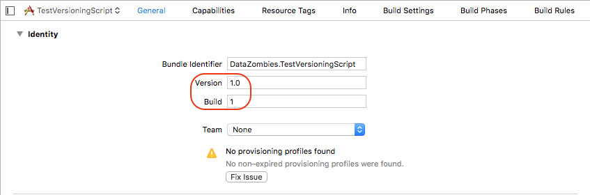
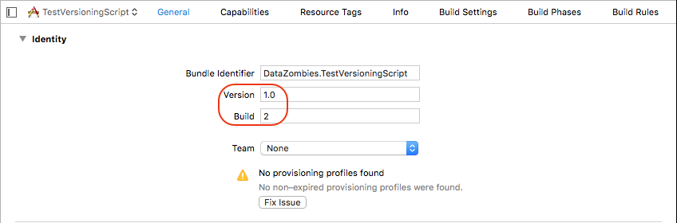
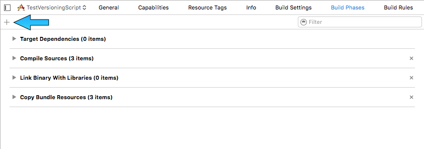
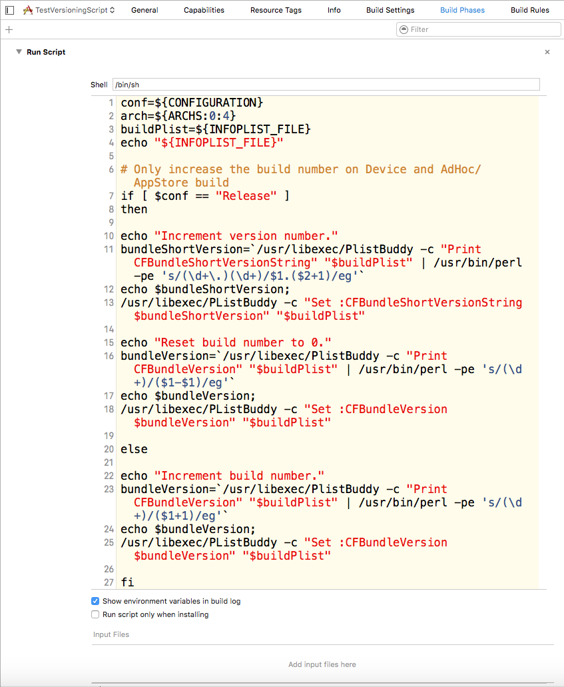
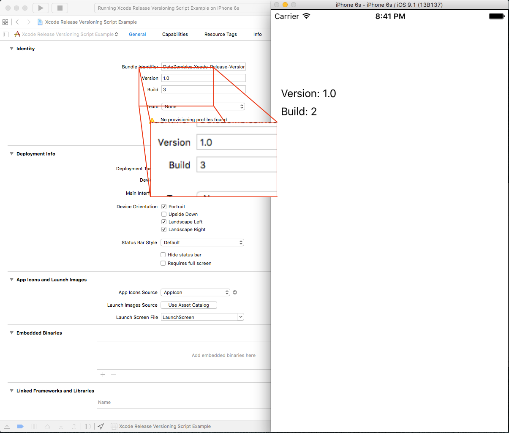

# Xcode-Release-Versioning-Script
Automatic Version and Build incrementation.
##Installing the Script
Turns the Version/Build numbers from this...

...to this...

...when building and archiving.
To install the script select project target, then click on Build Phases. If you don't see a section named "Run Script" click "+" in the top left corner.

Select "New Run Script Phase" in the popup menu. Expand the new Run Script section and verify that /bin/sh is in the Shell text field. Copy the contents of the Xcode Release Versioning Script.txt into the text field that says "Type a script or drag a script file from your workspace to insert its path". The Run Script section should look like this:

When you build the app for the simulator or for a device the build number will be incremented
When you archive the app for iTunes or Enterpirse Distribution the Version number will be incremented (1.0 -> 1.1) and the build number will be reset to 0.

One caveat. The Version and Build numbers are incremented **after** the build or achive.

##Using Version/Build Numbers in Code
The Version and Build numbers can be accessed with this code:

```Objective-C
  self.lblVersion.text = [NSString stringWithFormat:@"Version: %@", [[NSBundle mainBundle] objectForInfoDictionaryKey:@"CFBundleShortVersionString"]];
  self.lblBuild.text = [NSString stringWithFormat:@"Build: %@", [[NSBundle mainBundle] objectForInfoDictionaryKey:@"CFBundleVersion"]];
```